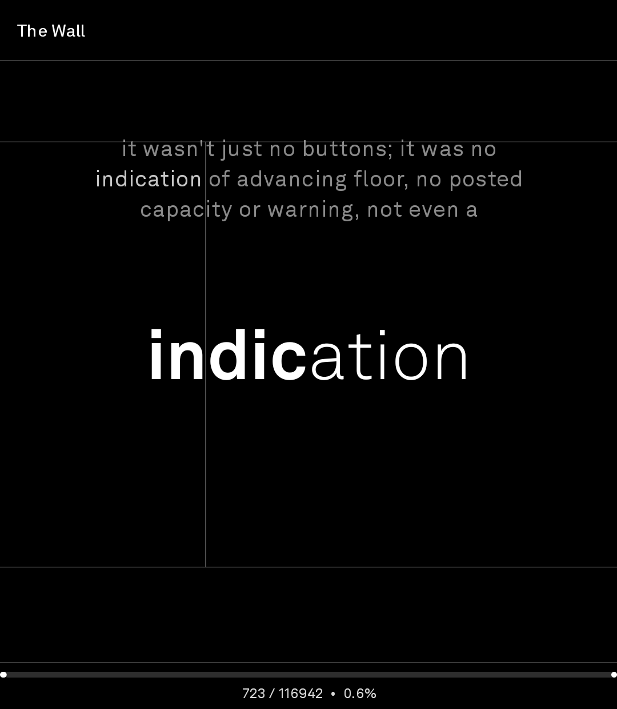
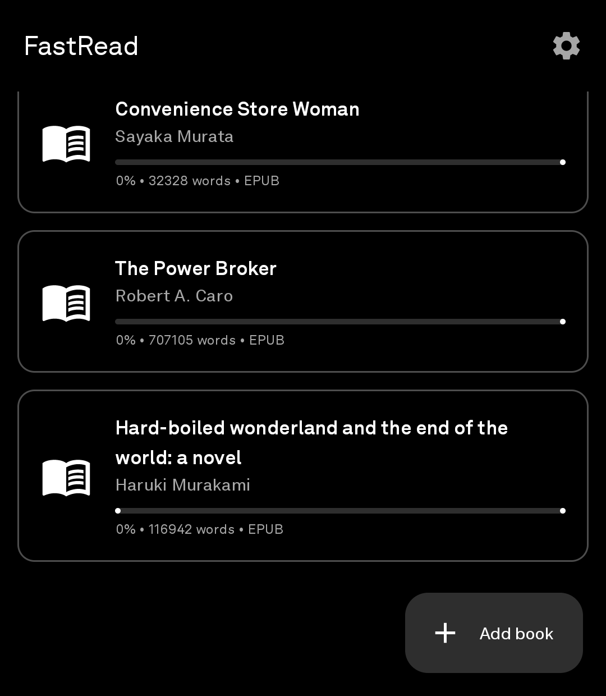

## Gio's LPIII fork — status as of 2026-08-05

This repo forks the FastRead RSVP reader for one piece of hardware: the Light Phone
III's 3.92", 1080×1240 black-and-white OLED (see [Credits](#credits) for the exact
upstream lineage — it's more tangled than a single fork arrow). Upstream's reading
engine, both ebook parsers and the whole gesture model are untouched here. What this
fork adds is the phone: a port of the real Light SDK design language, a cover shelf,
a hardware wheel, and a package identity that installs alongside any upstream FastRead
build without colliding.

## Install via BrightMarket

<p align="center">
  
</p>

Scan the code above with **BrightMarket** installed to open BrightLibrary there and
install or update it directly. Don't have BrightMarket yet? Get it, and browse
every Bright app, at
**[brightmarket.gzl.dev](https://brightmarket.gzl.dev)**.

**Named LightBooks since v1.5, on the surface only.** The launcher says "Books" and the
release titles say LightBooks. Everything an installed phone depends on is untouched:
`applicationId` is still `com.lightfastread`, the signing key is the same, the repo is still
**`gi-os/BrightLibrary`**, and the published APK is still `LightFastread-<version>.apk`. So the
rename updates in place — no reinstall, no lost books, and an existing Obtainium source keeps
working without being re-added. Every source package is still `com.lightfastread` too; the
namespace is load-bearing for the R class and the provider authorities.

**Current version:** `baseVersionName` in `app/build.gradle.kts` is `1.15.2-light.1`.
CI stamps `versionCode` and appends `-bN` to `baseVersionName` on every push to `main` —
see [Building](#building) below. Per-release notes are in [RELEASE_NOTES.md](RELEASE_NOTES.md).

### What's working today

- **Series collect into one cell.** Volumes of the same series are drawn as a stack on the shelf and
  open into a shelf of their own, in reading order. The series is parsed from the title rather than
  stored, so naming a book correctly is all it takes to file it — `Vol. 3`, `#3`, `Book 3` or `v03`,
  with trailing `(Digital)`-style tags ignored. A title that merely ends in a number is left alone.

- **4-koma mode**, cutting each page into four strips read as separate pages and remembered per series, with its own settings
  menu inside the reader (fit, crop, split, and whether tapping the edges turns pages at all).
- **Comics and manga, fitted to the width.** A page fills the screen's width and scrolls; one wheel
  notch is a screen down, the next one past the bottom turns the page. Pinch to zoom to 6x about the
  fingers, drag to pan, double-tap back to the fit. Optional white-border cropping measures where the
  ink is and trims the paper around it.
- **Comics and manga.** CBZ and image-EPUB volumes open in a page reader of their own — right to
  left by default, per-book toggle, tap-thirds to turn, double-tap to zoom, wheel to page. Pages are
  converted to greyscale at the panel's own resolution on import, so a 250 MB volume is about 20 MB
  on the phone and a page turn is a file read. Whether a file is a comic is decided by looking at it:
  mostly images and almost no text.
- **Setup by QR code.** Settings → Calibre → SCAN QR CODE fills in the server address, username,
  password and Kobo sync URL from one code, using ML Kit's bundled barcode model (LightOS has no
  Play Services). A plain calibre-web sync URL works too and fills in the address with it.

- **Your Calibre library, over OPDS.** LIBRARY on the shelf's bottom bar browses a Calibre server —
  calibre-web, `calibre-server` or COPS, they all publish the same catalogue — and downloads a book
  straight onto the shelf. Covers, titles and authors come from Calibre rather than from the file, so a
  book from the library never needs an Open Library lookup. SEARCH asks the server. Address and
  credentials in Settings -> Calibre.
- **Reading progress syncs back to calibre-web**, over the Kobo sync API (there is no progress field in
  OPDS). Push while reading and on leaving the app, pull on download so a book opens where another
  device left it. Each book records what the server was last told, so a phone that spends the day off
  the network catches up rather than losing anything. Needs Kobo sync enabled on the server and its
  sync URL pasted into Settings.

- **A shelf, not a list.** Two covers to a row, progress as a hairline under each. Cover
  art is read out of the EPUB or MOBI itself, then looked up on Open Library, and failing
  both the book gets a typographic cover. The shelf re-sweeps for missing covers on every
  open (backing off 12 hours per book), and the lookup cleans and widens its query rather
  than trusting ebook metadata to match a catalogue. Long-press for FIND COVER, FIX NAME
  or DELETE — a corrected title and author searches again straight away.
- **Covers in colour.** The shelf lifts LightOS's forced greyscale (the daltonizer, not a
  hardware limit) for as long as it is on screen, and drops it when you open a book. Needs
  a one-time `adb shell pm grant com.lightfastread android.permission.WRITE_SECURE_SETTINGS`;
  without it covers stay grey and nothing breaks. Toggle in Settings.
- **A book opens to its pages.** The full-page view is the book's home screen; tap the
  screen and a bar appears for four seconds with back on the left and FASTREAD on the right.
  Back out of the word reader returns to the pages.
- **The LightOS design language, ported for real** (`ui/light/`, from `lightphone/light-sdk`,
  MIT — see [LICENSE-light-sdk](LICENSE-light-sdk)): the 27 x 31 grid, the named type scale
  over a 600px baseline, the SDK icon set, top and bottom bars, no ripples, and selection
  shown by `[ brackets ]` rather than by a change of shade.
- The hardware wheel (`hw/LightKeys.kt` + `hw/Wheel.kt`) scrolls the shelf, Settings, the
  chapter list, the bookmark list and the quick-settings sheet, and turns pages in the page
  view — including inside `Dialog` sheets, which don't receive key events for free
  (`WheelInDialog()` borrows the sheet window's own callback).
- Package identity (`com.lightfastread`, both `namespace` and `applicationId`) is
  fully separated from upstream FastRead, so this build and an upstream build
  coexist on one device with no R-class or provider-authority collisions.
- CI is green on `main`: unit tests, a signed release build, a certificate-fingerprint
  check, and a launcher-icon check all gate the release before it publishes.

### LPIII constraints that shaped this fork

- **1080×1240 @ ~420dpi ≈ 411×472dp** — normal width, about half the usual Android
  phone height. Anything sized as a fraction of screen height (bottom sheets, FAB
  clearance in the library list) needed a second look against upstream's assumptions.
- **Forced greyscale.** LightOS's black-and-white look is Android's accessibility
  daltonizer pinned to monochromacy, not a hardware limit, but this fork doesn't fight
  it — the theme is greyscale by construction. Title and ORP accents are remapped
  through Rec. 709 luma into `0.62..1.0` so low-luma picks (the default red ORP
  letter, luma ≈ 0.36) stay legible next to dimmed context lines instead of sinking
  into them.
- **Matte panel**, roughly a stop less perceived contrast than glossy glass — alphas
  tuned for upstream's dark theme (0.45, 0.5) needed their floors lifted here: context
  lines, the paragraph pilcrow, the progress readout, the zone guides.
- **True black kills Material 3 tonal elevation.** Once every `surface*` role and
  `surfaceTint` are pinned to `#000000`, nothing distinguishes an elevated row from
  the background. Hairline `outline` edges (1dp) stand in for the tonal lift on book
  rows, the top bar, the chapter strip and the bottom sheet. `surfaceVariant` and
  dialog containers stay faintly grey on purpose, since Material's progress/slider/
  switch tracks and ephemeral containers (AlertDialog, menus) need something to read
  against — a scrim over black tints nothing.

### Changelog (this fork's own commits)

`git log` from `c7d1a4f` onward is this fork; the repo's `Initial commit` is the
upstream import point.

- v1.6 — Sweep for missing covers instead of searching once, widen the query, and let a
  book's title and author be corrected (FIX NAME)
- v1.5 — Rename to LightBooks, port the Light SDK design language, shelf of covers,
  covers in colour, and a book that opens to its pages (see [RELEASE_NOTES.md](RELEASE_NOTES.md))
- `d377fb3` — CI: actually check working branches
- `2f38b86` — Add a full-page ereader mode, opened by tapping the context preview
- `440482b` — Say in the README what the wheel needs
- `09fc696` — Scroll with the wheel
- `ff0bf61` — docs: add BrightNoise and LightPods to the collection table
- `8d47df9` — ci: trigger a second signed build to prove certificate stability
- `4854065` — ci: fix the certificate digest parser
- `12e4acc` — Sign every release with one stable key so installs can be updated
- `b3f4c3f` — docs: add BrightTip to the collection table
- `bd2f354` — Make the reader's zone guides a toggle, off by default
- `f135c55` — Add a FogLight-matched launcher icon
- `9e09c25` — Swap descriptions in README.md table
- `f1f9009` — docs: real screenshots, correct upstream credit, collection table
- `4c48083` — Move package to com.lightfastread so it can never collide with FastRead
- `19ff5b4` — Rename to BrightLibrary
- `0947241` — docs: document the push-triggered versioned release flow
- `885a95d` — ci: auto-publish a versioned APK on every push to main
- `5029b18` — build: mark gradlew executable
- `58d1025` — ci: fix startup failure and add Android SDK
- `c7d1a4f` — Retune for Light Phone III: true-black OLED theme, greyscale palette, near-square layout

Two upstream landmines worth knowing before you build this yourself: `gradlew` was
committed as mode `100644` (CI dies with exit 126 until it's executable), and
`gradle/gradle-daemon-jvm.properties` pins the Gradle daemon to **JetBrains JDK 21**
— `setup-java` needs `distribution: jetbrains` to match, or Gradle tries to
provision a second JDK over the network on every run.

---

# BrightLibrary

**An ebook reader for the Light Phone III, forked from [FastRead](https://github.com/fluffyspace/FastRead).**

Everything upstream does, on a screen where every lit pixel is a choice: pure `#000000` on
every surface, a greyscale palette, and layout that assumes a 3.92" near-square panel
instead of a tall glossy one.

Upstream FastRead is unchanged in behaviour here. This fork only touches presentation.

---

## What's different from upstream

| Change | Why |
| ------ | --- |
| **The Light SDK design language, ported into `ui/light/`** | v1.5. A black Material 3 palette still lays out like Material: fixed dp, a floating action button, ripples, tonal elevation. LightOS lays out on a 27 x 31 grid with a named type scale and no ripples at all, and `lightphone/light-sdk` is MIT, so the real thing can be ported rather than approximated. Material stays underneath only so the surviving sliders and the sheet windows inherit the palette. |
| **The library is a shelf of covers, two to a row** | v1.5. A one-line-per-book list is what a file manager shows you. Cover art is how anyone actually finds a book, and it is the one thing on this phone worth turning the colour back on for. |
| New **Light Phone** theme mode, default on first run | Kept separate from `Dark` rather than replacing it, so this fork stays rebaseable on upstream. |
| Every `surface*` role is `#000000`, `surfaceTint` is black | Material 3's dark scheme uses `#1C1B1F`-ish greys plus tonal elevation overlays. On an OLED that's a lit grey slab where there should be nothing. Black `surfaceTint` makes `surfaceColorAtElevation` resolve to black at every elevation. |
| Hairline outlines replace tonal elevation | Once tonal lift is gone, book rows, the top bar, the chapter strip and the bottom sheet are black-on-black with no visible boundary. They get 1dp `outline` edges instead — one row of dim grey rather than a whole grey rectangle. |
| Title and ORP accents flattened to grey | The panel is greyscale, so the orange title and red ORP letter arrive as whatever grey their luminance happens to be. Rec. 709 luma is remapped into `0.62..1.0` so low-luma picks (the default red, luma ≈ 0.36) stay legible instead of sinking into the dimmed context lines. |
| Contrast floors on de-emphasised text | Matte glass diffuses light and costs roughly a stop of perceived contrast. Context lines, the paragraph pilcrow, the progress readout and the zone guides all had alphas tuned for glossy glass. Relative ordering is preserved; the bottom of the range is lifted. |
| Zone guides are off by default and toggleable | Upstream draws the gesture boundaries permanently. On a pure-black screen that grid competes with the text instead of receding behind it, and it's only genuinely useful while you're still learning where the zones are. |
| `surfaceVariant` and the dialog containers stay faintly grey | These back Material's *tracks* (progress bar, slider rails, switch tracks) and its *ephemeral* containers (AlertDialog, menus). Pure black would erase the tracks entirely, and a scrim over an already-black background tints nothing — a black dialog on a black screen is unanchored text. |
| Black `windowBackground` in `themes.xml` | The launch theme is what Android paints during cold start, before Compose draws. The stock `Material.Light` parent flashed white — a full-brightness strobe on every launch. |
| ~~Book list padded past the FAB~~; bottom sheets allowed to go taller | The LPIII is roughly **411 × 472 dp** — normal width, about half the usual height. Anything sized as a fraction of screen height needed a second look. `Scaffold` reserves no space for the FAB, so the last book row sat permanently under "Add book". |
| The brightness wheel scrolls every list | The LPIII has a hardware wheel and upstream has never heard of it. Lists here are the one place the touchscreen is worst — a 472dp-tall panel behind matte glass, with the whole reader surface already spoken for by hold-and-swipe gestures. |
| `targetSdk` 34; package fully renamed to `com.lightfastread` | LightOS is Android 14, and the light-sdk emulator profile is API 34; no reason to opt into 35/36 behaviour the device will never see. Both `namespace` and `applicationId` are `com.lightfastread`, so this shares no identifier with upstream FastRead — not the package, the R class, or the permission and provider authorities AndroidX derives from them. It installs cleanly alongside any other FastRead build. |

Part of the [Bright* collection](https://brightmarket.gzl.dev).

### The wheel

Turning the phone's wheel scrolls the library, the Settings screen, the chapter list, the
bookmark list and the quick-settings sheet. It is not a rotary encoder: LightOS relabels an
optical sensor's scancodes as `WHEEL_CCW` / `WHEEL_CW` and dispatches them as ordinary key
events, so `hw/LightKeys.kt` resolves those labels at runtime and falls back to the raw
scancodes if Light moves them.

Notches arrive faster than a frame, so applying each one where it lands gives a stack of
jumps rather than a scroll. `hw/Wheel.kt` treats a notch as a debt and pays off a share of it
per frame, and it ignores the first notch after a pause — the wheel sits under a thumb and
catches stray brushes.

Two things this fork needed that the shared module didn't have. The sheets are `Dialog`s,
and a dialog is a window of its own: the Activity's `dispatchKeyEvent` never runs while one
is up, so `WheelInDialog()` borrows the sheet window's callback for as long as the sheet
lives. And the wheel *click* and camera button are deliberately untouched.

**Nothing else has to be installed for any of this, and nothing has to be granted.** Light
patched `Generic.kl` phone-wide, so the notches are ordinary key events delivered to whichever
app holds focus, and this fork reads them itself — no accessibility service, no permission, no
root. Sideload the APK and the wheel scrolls.

[BrightControl](https://github.com/gi-os/BrightControl) is optional, and it owns the parts of the
wheel this app leaves alone: hold the wheel in and turn for brightness, tap it for the
flashlight, the camera button to open the camera. Each is rebindable, tap and hold separately,
to any installed app, and apps with no wheel code of their own get brightness or a
synthetic-swipe scroll instead of a dead wheel.

Installing it doesn't cost you scrolling here. `com.lightfastread` is on its pass-through list
along with `com.gios.*` and `com.lightrss.reader`, so bare turns still arrive as keys and this
app still scrolls per notch — which is the point of the list: a real scroller beats a synthetic
finger.

```bash
# Optional: BrightControl, for brightness, the flashlight and the camera button
adb install -r LightControl-v1.0.x.apk

# The key service. NOTE: this setting is a list, and this command REPLACES it —
# if you also run LightVoice's push-to-talk, colon-join both components instead.
adb shell settings put secure enabled_accessibility_services \
  com.gios.lightcontrol/com.gios.lightcontrol.keys.ControlService
adb shell settings put secure accessibility_enabled 1

# Brightness, and the level readout + opening apps from the service
adb shell appops set com.gios.lightcontrol WRITE_SETTINGS allow
adb shell appops set com.gios.lightcontrol SYSTEM_ALERT_WINDOW allow
```

Latest build: <https://github.com/gi-os/BrightControl/releases/latest>.

### Icon


An open book: a page of dashed text on the left, collapsed to a single ringed word on the
right. That asymmetry *is* RSVP — the whole book, reduced to one focal point.

Drawn to match [FogLight](https://github.com/gi-os/FogLight) so the two read as siblings on
the device: heavy white line art on a full-bleed pure-black square, round caps, 30/1024
outline and 24/1024 detail strokes, ink filling ~62% of the canvas. The ringed dot echoes
the pins FogLight's dashed route runs between.

`scripts/generate_icon.py` defines the geometry once in a 1024-unit space and emits both
the mipmap WebPs and the adaptive icon's `VectorDrawable`, so the raster and vector can't
drift apart. Re-run it after any change.

<br clear="left">

---

## Installing on a Light Phone III

Light's own [light-sdk](https://github.com/lightphone/light-sdk) is the sanctioned path for
LightOS "Tools", and community tools will eventually be built and signed by Light. This is
a plain sideloaded APK, not an SDK tool, so for now:

```bash
# Every push to main publishes a signed build to Releases:
adb install -r LightFastread-<version>.apk
```

Each release carries exactly one APK, signed with a stable key. Nothing needs
uninstalling first; the package ID is unique to this fork.

### Obtainium

Add `https://github.com/gi-os/BrightLibrary` as a GitHub source. There is one `.apk` per
release, so there's nothing to disambiguate, and every build is signed with the same key —
updates apply in place.

Releases up to and including `build-11` cannot be updated from. The release APK was
unsigned, and the debug APK was signed with the throwaway `~/.android/debug.keystore`
that a CI runner regenerates on every job — so consecutive builds had *different*
certificates. Android rejects both cases, and Obtainium reports either as
`Failure: Invalid`. **If you installed build-11 or earlier, uninstall once**, then install
`build-12` or later; updates are stable from there on.

Two caveats worth knowing before you start, both from Light's own docs as of July 2026:

- There is **no easy distribution path yet**. ADB sideloading works if you're comfortable
  with it, but LightOS builds in the wild aren't ready to play nicely with SDK-built tools.
- LightOS will let you run unsigned/third-party APKs only under the **"Any tools"** setting,
  and Light explicitly warns that you own the install/uninstall lifecycle there.

### Testing without hardware

Light publishes an emulator profile that behaves close to real hardware:

- **1080 × 1240, 3.92" display**
- **Android API 34**
- **No Google Play Services**

That's the configuration this fork was designed against. Note the emulator renders in
colour — the real panel is black and white, which is exactly why the palette here is
greyscale by construction rather than "colours that happen to look fine in dark mode".

---

## Building

`.github/workflows/build.yml` builds, tests and publishes on every push to `main` — no
tagging step needed. Each run:

1. builds and tests, then signs the release APK,
2. stamps `versionCode` with the **workflow run number** and `versionName` with a `-bN`
   suffix, so each build is strictly newer than the last,
3. verifies the signing certificate against `signing-fingerprint.txt`,
4. publishes a GitHub Release tagged `build-N`, marked latest, with the single signed APK
   attached. The debug build stays a workflow artifact, so Obtainium can't pick it up by
   mistake.

Because `versionCode` always increases, `adb install -r` upgrades in place — no uninstall,
no lost library or reading positions.

`baseVersionName` in `app/build.gradle.kts` is the single source of truth for the version
number; the workflow greps it to name the artifacts. Bump it there when the version changes.

Tagging `v*` additionally cuts a release with generated notes, for when you want a
hand-marked version rather than a rolling build.

Signing is mandatory. Four repository secrets drive it — `RELEASE_KEYSTORE_BASE64`,
`RELEASE_STORE_PASSWORD`, `RELEASE_KEY_ALIAS`, `RELEASE_KEY_PASSWORD` — and the build
**fails** if the keystore secret is missing rather than quietly emitting an unsigned APK.

The signing certificate's SHA-256 is pinned in `signing-fingerprint.txt` and CI compares
every build against it. If the keystore is ever lost or replaced, the build fails loudly
instead of shipping an APK that no existing install can update to.

Locally:

```bash
./gradlew assembleDebug     # requires JDK 17+ (AGP 9.x) and Android SDK 36
```

Drop a `keystore.properties` next to `settings.gradle.kts` (`storeFile`, `storePassword`,
`keyAlias`, `keyPassword`) and local builds — debug included — are signed with the same key
as CI, so they can replace a released build in place. It's gitignored.

Local builds get `versionCode = 1`, so if a CI build is already on the device you'll need
`adb install -r -d` to allow the downgrade.

---

## Screenshots

These two are this fork, on a Light Phone III.

| Library | Reader |
| :---: | :---: |
|  |  |
| One word at a time, three lines of context above it, bionic mode on, zone guides toggled on. | Imported EPUBs with word counts and progress. Hairline outlines stand in for the tonal elevation an OLED cannot afford. |

The next two come from upstream and still show the original purple and light interface.
They are here because this fork changes no behavior on either screen.

| Settings (upstream) | Quick settings (upstream) |
| :---: | :---: |
|  |  |
| Input mode, speed, pauses, fonts, bionic, theme. | In-reader sheet for live font and size changes. |

---

## Why FastRead

Most RSVP apps either bury you in buttons, lock features behind a subscription, or require you to push your library into someone else's cloud. FastRead is the opposite:

- **One-gesture reading.** No play/pause buttons. Hold to read, drag to change speed, release to stop. That's the whole interface.
- **Your library stays yours.** Books are imported from local storage via the system file picker and cached privately inside the app's own files directory. Nothing leaves the device.
- **Native parsers, no bloat.** EPUB and MOBI parsing are written from scratch in Kotlin. No third-party ebook libraries pulled in.
- **100% Kotlin + Jetpack Compose.** Modern Android stack, single-Activity, navigation-driven, easy to fork and hack on.
- **No internet permission requested.** The app cannot phone home because it has nothing to phone home with.

---

## Features

### Reading

- **RSVP one-word-at-a-time presentation** with a large, configurable focal word.
- **Three input modes**, switchable in settings:
  - **Hold zones** — hold the right 2/3 of the screen to advance, hold the left 1/3 to step back or auto-rewind.
  - **Swipe** — swipe right to advance, left to go back; distance per word is configurable.
  - **Zone swipe** — combine zones with swipe direction for fine control.
- **Optional zone guides.** Hairlines along every gesture boundary, toggleable from Settings or the in-reader quick-settings sheet. Off by default — upstream drew them permanently, which on a black screen reads as a bento-box grid over your book.
- **Speed mapped to finger position.** In hold-zones mode, where you press in the forward zone is your WPM (left edge = `minWpm`, right edge = `maxWpm`).
- **Smooth ramp-up** from 0 to target WPM on press, so speed changes never feel jarring.
- **Tap-to-step-back vs. hold-to-rewind** in the backward zone, separated by a configurable threshold.
- **Three-line context window** above the focal word so you don't lose your place when you blink.
- **Smart pauses** at sentence ends and paragraph breaks, scaled to your current reading speed.
- **Per-letter slowdown** for long words — give your eyes a few extra milliseconds on the hard ones.
- **Bionic reading** mode that bolds the leading letters of each word; apply it to the focal word, the context lines, both, or neither.
- **Per-book progress** saved automatically and resumed on the next open.
- **Full-page ereader mode.** Tap the context preview instead of holding it to
  open a whole page of the book; swipe or turn the wheel to move between pages,
  with an iOS 6-style 3D flip. Closing it resumes RSVP from wherever you landed.

### Library

- **Import EPUB and MOBI** via the Android Storage Access Framework — works with anything in your local storage, on an SD card, or in a cloud-sync folder you've already mounted.
- **Long-press to delete** with a confirmation dialog.
- **At-a-glance progress** bars on every book in the library list.

### Look & feel

- **Material 3 design**, with a hand-built greyscale scheme for the Light Phone III.
- **System / Light / Dark / Light Phone** theme switching. Light Phone is pure `#000000` greyscale.
- **Live font preview** in settings: size and family (default, serif, sans-serif, monospace).
- **Quick-settings sheet** on the reader screen for tweaking font size and family without leaving your book.

---

## Supported formats

| Format | Notes |
| ------ | ----- |
| `.epub` (EPUB 2 / 3) | ZIP container, OPF spine traversal, HTML stripped to plain text. |
| `.mobi` (PalmDOC compression, type 1 & 2) | Native PDB/PalmDOC decoder. |
| `.mobi` (HUFF/CDIC compression, type 17480) | Not supported — surfaces a friendly error. |

Rich rendering (images, layout, footnotes) is intentionally out of scope. Speed reading is plain words.

---

## Installation

> No Play Store listing yet. FastRead is distributed as source and via GitHub Releases (when tagged).

### Build from source

Requirements:

- Android Studio Hedgehog or newer (or just the Android SDK + Gradle)
- JDK 17
- Android SDK 36 with build-tools

Steps:

```bash
git clone https://github.com/gi-os/BrightLibrary.git
cd BrightLibrary
./gradlew assembleDebug
# APK lands in app/build/outputs/apk/debug/
```

Or open the project in Android Studio and hit Run.

Minimum SDK: **24 (Android 7.0 Nougat)**. Target SDK: **36**.

---

## Quick start

1. Tap **Add book** on the home screen and pick an `.epub` or `.mobi` file.
2. Tap the imported book to open the reader.
3. **Hold the right side of the screen** to start reading. Slide your finger left to slow down, right to speed up. Release to stop.
4. **Tap the left side** to step back one word. **Hold the left side** to auto-rewind.
5. **Tap the very top of the screen** to reveal the title bar with a back button and quick-settings shortcut.

---

## Configuration

All settings persist via SharedPreferences (JSON-encoded, no database). They can be tweaked live from the Settings screen:

| Setting | Default | What it does |
| ------- | ------- | ------------ |
| Min WPM | 100 | Reading speed at the left edge of the forward zone. |
| Max WPM | 500 | Reading speed at the right edge of the forward zone. |
| Speed ramp-up | 300 ms | Time to ease from 0 to target WPM after pressing. |
| Backward hold delay | 500 ms | Tap shorter than this = step back; longer = auto-rewind. |
| Pause after sentence | x1.0 | Multiplier applied to the inter-word interval after `.`, `!`, `?`. |
| Pause after paragraph | x2.0 | Same, applied at paragraph breaks. |
| Extra ms per letter | 0 | Adds delay to long words. |
| Letter delay threshold | 5 | Word length above which the per-letter delay kicks in. |
| Font size | 56 sp | Focal word size. |
| Font family | Default | Default / Serif / Sans-serif / Monospace. |
| Bionic mode | Off | Off / Main only / Context only / Both. |
| Theme | Light Phone | System / Light / Dark / Light Phone (true black). |
| Input mode | Hold zones | Hold zones / Swipe / Zone swipe. |
| Show zone guides | Off | Draws hairlines along every gesture boundary. Off by default. |
| Swipe distance per word | 10 dp | Only used in swipe-based input modes. |

---

## Architecture

```
app/src/main/java/com/fastread/
├── MainActivity.kt          # NavHost + theme wiring
├── data/                    # Book, Settings, repositories (SharedPreferences + JSON)
├── hw/                      # Light Phone III wheel: key recognition + notch bus
├── parser/                  # EPUB, MOBI, HTML strip — all hand-written
└── ui/
    ├── home/                # Library list + SAF importer
    ├── reader/              # Gesture surface + RSVP loop
    ├── settings/            # All configurable values
    └── theme/               # Material 3 theme + dynamic color
```

- **UI:** Jetpack Compose + Navigation Compose. Three destinations: `home`, `reader/{bookId}`, `settings`.
- **Persistence:** SharedPreferences for the book list and settings (kotlinx.serialization JSON). Each imported book's extracted text is cached as a plain `.txt` file in the app's internal `files/books/` directory.
- **Parsers:**
  - `EpubParser` — reads the ZIP, locates the OPF via `META-INF/container.xml`, walks the spine, strips HTML.
  - `MobiParser` — parses the PDB header, decompresses PalmDOC (type 2) or reads uncompressed (type 1), strips HTML.
  - `HtmlStripper` — minimal tag remover with entity decoding; sized for ebook body text.
- **Progress:** `currentWordIndex` per book is debounce-saved on change and on screen dispose, so you never lose your place.

### Dependencies

Compose BOM, Navigation Compose, Material 3 + extended icons, Lifecycle, AndroidX Activity, AndroidX DocumentFile, kotlinx-serialization-json. That's it. No analytics, no crash reporters, no networking libraries, no ebook SDKs.

---

## Privacy

- **No internet permission.** Check `AndroidManifest.xml`.
- **No analytics, no telemetry, no crash reporting.**
- **No accounts, no sign-in.**
- **Book contents never leave the device** — they live in the app's internal files directory and are removed when you uninstall.

---

## Roadmap / non-goals

**Could land later** (PRs welcome):

- ORP (Optimal Recognition Point) focal-letter highlighting.
- More formats: plain `.txt`, `.fb2`, PDF text extraction.
- Library sorting / search / collections.
- Export reading stats (locally).

**Intentionally out of scope:**

- Cloud sync, accounts, library sharing.
- Rich rendering (images, formatting, footnotes).
- HUFF/CDIC-compressed MOBI (rare in practice; surfaces a friendly error).
- DRM-protected ebooks.

---

## Contributing

Bug reports and PRs are welcome. A few notes:

- Keep dependencies lean. New libraries should be justified.
- Match the existing Compose / repository style; no DI framework, no architectural ceremony.
- For reader-loop changes, test at both extremes: very slow (under 100 WPM) and very fast (over 1000 WPM). Smoothness at the edges matters.
- See `CLAUDE.md` for a concise tour of the codebase aimed at newcomers (and AI assistants).

---


## License

FastRead is released under the **GNU General Public License v3.0** (GPL-3.0). See [LICENSE](LICENSE) for the full text.

In short: you are free to use, study, modify, and redistribute the app, but any distributed derivative work must also be released under GPL-3.0 with source available. This keeps FastRead and its forks open to the community.

---

## Credits

The reading engine, both parsers and the whole gesture design belong to
**[fluffyspace](https://github.com/fluffyspace)**, in
[fluffyspace/FastRead](https://github.com/fluffyspace/FastRead). This fork contributes a
display treatment for one piece of hardware and nothing else. Thank you.

[queueingqt/FastRead](https://github.com/queueingqt/FastRead) is a fork of that original,
not the source. An earlier version of this file credited it by mistake.

RSVP as a reading technique has been around for decades; FastRead's contribution is a tight, gesture-first Android implementation that respects your privacy and your library.

<!-- bright-footer:begin -->
---

## Bright\*

**It's not Light, it's Bright.**

26 open-source apps for the **Light Phone III** — camera, music, maps, messages,
reading, transit, games. The phone has no app store, so they install by sideload: scan one
code from **[brightmarket.gzl.dev](https://brightmarket.gzl.dev)** and BrightMarket keeps them updated.

[Roll](https://github.com/gi-os/Roll) · [BrightNotebook](https://github.com/gi-os/BrightNotebook) · [BrightControl](https://github.com/gi-os/BrightControl) · [BrightWay](https://github.com/gi-os/BrightWay) · [BrightChat](https://github.com/gi-os/BrightChat) · [browse all 26 →](https://brightmarket.gzl.dev)

The Light Phone does not sponsor or endorse any of these. Built by
[Giovanni Lupo](https://github.com/gi-os) — if this one is useful to you, a ⭐ helps the next
person find it.
<!-- bright-footer:end -->
